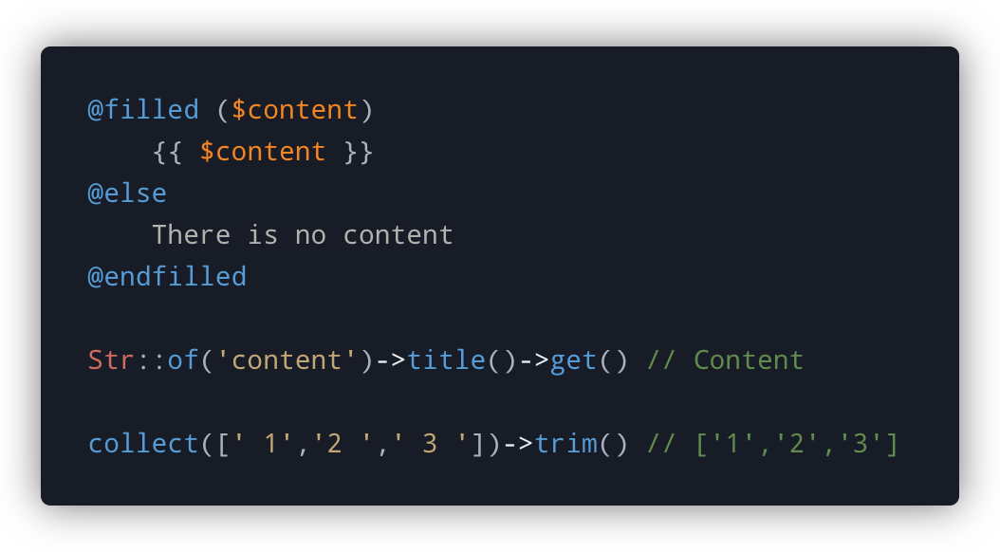
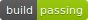
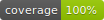
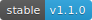

<!-- Screenshot -->
<p align="center">
    
</p>

<!-- Badges -->
<p align="center">
  
  
  
  
</p>

# Elevate

This package provides a library of macro functions for various Laravel components. Use them to augment the existing functionality offered by the likes of Blade, Collections, Stringable, and so on.

Initially, only a handful of macros are available. That said, the library has been designed so that it can handle dozens or even hundreds of macros being added over time.

Each individual macro may also be disabled, thus ensuring that Laravel isn't spending precious time registering macros you are not using.

## Installation

Pull in the package using composer

```bash
composer require mattkingshott/elevate
```

## Configuration

If you wish to make all of the macros available to your application, then you can skip this section. Otherwise, you should publish the configuration file:

```bash
php artisan vendor:publish --provider="Elevate\ServiceProvider"
```

You may wish to disable a particular macro for one of the following reasons:

1. Performance - if you aren't using the macro, or even the class itself, then disabling it will net a tiny performance boost.
2. Conflicts - if you already have a macro for a class, or wish to create one with the same name, you should disable the Elevate macro to prevent conflicts.

To disable a macro from being registered, simply set its value to `false`:

```php
'Blade' => [
    'Blank'  => true,
    'Filled' => false,
];
```

## Available macros

The following macros are currently available:

| Macro  | Class      | Description                                                                                                                         |
| ------ | ---------- | ----------------------------------------------------------------------------------------------------------------------------------- |
| Filled | Blade      | Enables the use of @filled() and @endfilled. Uses the filled() global helper under the hood. You may also use @else e.g. @filled() @else @endfilled. |
| Blank  | Blade      | Enables the use of @blank() and @endblank. Uses the blank() global helper under the hood. You may also use @else e.g. @blank() @else @endblank.      |
| Get    | Stringable | Adds a more friendly helper to access a fluent string's content e.g. Str::of('test')->get() // test                                 |
| Trim   | Collection | Maps over each item in the collection and calls PHP's trim() method on it |

## Contributing

Thank you for considering a contribution to Elevate. You are welcome to submit a PR containing a new macro or improvements to existing ones, however please also be sure to include a test or tests where appropriate.

## Support the project

If you'd like to support the development of Elevate, then please consider [sponsoring me](https://www.paypal.com/cgi-bin/webscr?cmd=_s-xclick&hosted_button_id=YBEHLHPF3GUVY&source=url). Thanks so much!

## License

The MIT License (MIT). Please see [License File](LICENSE.md) for more information.